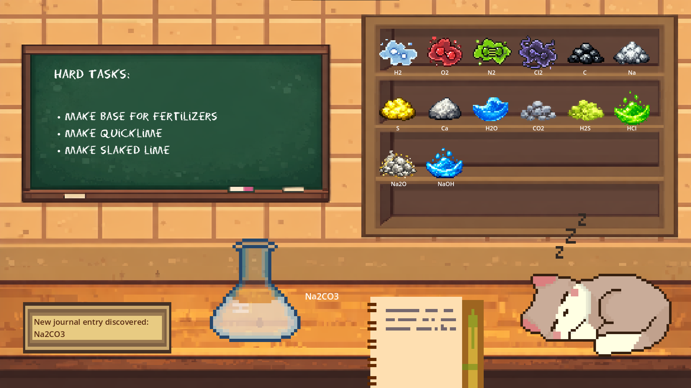

# Experimentarium

**Experimentarium** is an educational chemistry game where players learn through experimentation.

The player enters a laboratory where only a limited set of reagents is available.  
Each level has a specific chemical compound that must be obtained, but the path to reach it is not given directly.

The player must discover it through experimentation, observation, and deduction.

  

## Core Gameplay Loop

The core gameplay loop is simple and intuitive:

**Combine reagents → observe the reaction → discover new substances or consequences → use the gained knowledge to progress toward the level objective.**

Each reaction can produce one of three outcomes:

- **Positive** – new substances are discovered or the player progresses toward the goal.
- **Neutral** – no observable reaction occurs.
- **Dangerous** – the reaction is violent and the experiment fails, forcing the player to restart the level.

For example, mixing **sodium (Na) with water (H₂O)** produces an explosive reaction.  
This discourages completely random experimentation and introduces the concept of real chemical risk.

---

## Learning System

Experimentarium encourages learning through two complementary approaches.

### 1. Exploration

Players can freely combine reagents and learn from the results, much like in a real laboratory.

This method is fast but risky, as some reactions may fail or become dangerous.

### 2. The Journal

Every time a new reaction is discovered, it is automatically recorded in an in-game **journal/manual**.

The manual does not give the solution directly. Instead, it contains carefully selected information about:

- chemical properties
- possible reactions
- safety warnings

These hints are designed to guide the player toward correct combinations through reasoning rather than memorization.

---

## Educational Philosophy

Experimentarium models the real scientific process:

**Experiment → Observation → Deduction → Progress**

Instead of presenting chemistry as a list of formulas to memorize, the game encourages players to think like scientists and discover chemical behavior through experimentation.

---

## Features

- chemistry-based puzzle gameplay
- progressive reagent discovery
- reaction outcome system (positive / neutral / dangerous)
- in-game journal that grows as discoveries are made
- educational hints based on real chemical properties
- risk-reward experimentation system

---

## Technology

The game was developed using:

- **Godot Engine**
- **GDScript**

---

## Repository Purpose

This repository was published for **hackathon evaluation and portfolio purposes**.

---

## License

© 2026 Dan Lisii. All rights reserved.

This repository is provided for **viewing purposes only**.

The source code, game design, and all assets (including sprites, sounds, and visual materials) are the intellectual property of **Dan Lisii** and may **not be copied, modified, distributed, or used in other projects** without explicit written permission.
